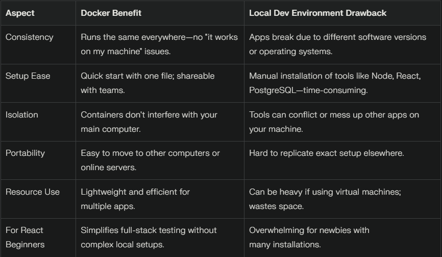

### Docker basics

Docker is a free software tool that packages apps into portable units. It solves problems where an app works on your computer but not on someone else's due to differences in setup.

> Simple React example: If you're making a React app (e.g., a basic page with buttons), Docker lets you package it so it runs perfectly on Windows, Mac, or Linux without setup headaches.

#### What is a container?

A container is like a sealed box that holds your app's code, tools, and a mini environment. It's isolated (separate from your main computer) and lightweight (doesn't use much space or power).

#### Difference from a virtual machine:

A virtual machine is like a full fake computer inside your real one—it's heavy and slow. A container shares your computer's core but isolates the app, making it faster

#### Key Docker terms:

- Image: A ready-to-use template or snapshot of your app's setup. Like a frozen recipe you can copy and run anywhere. You get images from Docker Hub (a free online library of templates).
- Container (running): When you start an image, it becomes a live container—like thawing the frozen recipe and cooking it.
- Dockerfile: A simple text file with step-by-step instructions to create your own image. Example: "Start with basic JavaScript tools, add my React code, install extras."

### Dockerize Your Full-Stack App

"dockerize" means turning your app into Docker containers. This builds on images and Dockerfiles. It's useful for full-stack apps (frontend + backend + database).

Steps to dockerize (hierarchical breakdown):

1. Plan your app parts: For a full-stack setup, split into frontend (React), backend (Node.js), and database (PostgreSQL).
2. Create Dockerfiles: One for each part. Example for React: The file says, "Copy my code, run installation commands like npm install (which gets helper tools), and prepare to run."
3. Build images: Use the command docker `build` to turn the Dockerfile into an image.
4. Run containers: Use docker run to start them. Now your React frontend can connect to the Node.js backend.

### Docker vs local dev environment

> Skipped: <u>Use docker-compose to run PostgreSQL + Node + React together </u>
