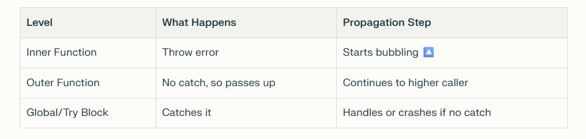

> Error Handling, Try/Catch, and Defensive Code, Error propagation with try/catch/finally, throw , custom Error classes, Promise rejection, Errors inside async functions, Synchronous vs. asynchronous throw/catch, Defensive coding patterns (guard clauses, assertions), Re-throwing errors, error boundary patterns, How does error handling differ between synchronous and asynchronous JavaScript code?, What’s the risk of swallowing errors in a promise chain?

## Error handling

try catch finally

## Defensive code

To track and add checkpoints for code detection.

## Error propagation

It is also same as error handling, it says that to if try catch not being add, the error will propagate to rest of the code.

- try - To track the error
- catch - Hold the error
- finally - will run always
- throw - to throw error manually

## Custom Error classes

Create your own error types by extending the built-in Error class. This adds details like codes or messages.

```js
class MyCustomError extends Error {
  constructor(message) {
    super(message);
    this.name = "MyCustomError";
    this.code = 404; // Extra info!
  }
}

throw new MyCustomError("Not found!");
```

## Promise Rejection

Promises can "reject" if something fails (like a bad network call). Handle with `.catch()`.

Example:

```javascript
fetch("bad-url")
  .then((response) => console.log("Success!"))
  .catch((error) => console.log("Rejected: " + error));
```

## Errors inside async

```js
async function fetchData() {
  try {
    let data = await fetch('url');
  } catch (error) {
    console.log("Async error: " + error); ⚠️
  }
}
```

## Defensive guard coding pattern

1. Guard classes- Check conditions at the start and exit if bad.

```js
function divide(a, b) {
  if (b === 0) return "Can't divide by zero!"; // Guard 🚧
  return a / b;
}
```

2. Assertions: - Use console.assert or libraries to check assumptions.

```js
console.assert(age > 0, "Age must be positive!");
```

> The **assert()** method writes a message to the console if an expression evaluates to **false**.

## Re-throwing Errors

Re-throwing means you catch an error at one level, do some partial handling (like logging), then throw it again to send it to even higher levels for more handling.

Why? You might want to add info or log locally but let a top-level handler (e.g., in your app's main code) decide the final action, like showing a user alert.

Example:

```javascript
function processData(data) {
  try {
    if (!data) throw new Error("No data!"); // Initial throw.
  } catch (error) {
    console.log("Low-level log: " + error); // Partial handle.
    throw new Error("Processing failed: " + error.message); // Re-throw with more info to higher level! 🔄
  }
}

try {
  processData(null); // Calls and error propagates.
} catch (error) {
  console.log("High-level handle: Show user alert - " + error); 🚨
}

```

## Throw keyword - Detail

- The throw keyword is like a stop sign.
- Check if data is correct. If not, throw to prevent further issues.
- Stop execution and jump to error-handling code, like showing a user message.

#### Flow - How Throw Propagates to Higher Levels (Error Bubbling) 🔄

When you throw an error, it doesn't just stop at that spot – it "propagates" (travels up) through the function call stack 🪜. This means the error moves to the calling function, then its caller, and so on, until it's caught by a try/catch or reaches the top (global scope) and crashes the program.

**Step-by-Step How It Works:**

- Throw Happens: Inside a function, throw creates an error object and halts execution.

- Search for Catch: JS looks for the nearest try/catch in the current function. If none, it exits the function and checks the caller.

- Bubbling Up: Continues up the stack (higher levels) until caught. If uncaught, it logs to console or stops the app.

_Why This is Useful: Lets outer functions (higher levels) decide how to handle errors, like logging or retrying._

```js
function innerFunction() {
  throw new Error("Problem inside! 💥"); // Throws here.
}

function outerFunction() {
  innerFunction(); // Calls inner, innerFunction throw error bubbles up here.
}

try {
  outerFunction(); // Error propagates to this higher level catch.
} catch (error) {
  console.log("Caught at higher level: " + error); 🛡️
}

```



## What’s the risk of swallowing errors in a promise chain?

"Swallowing" means not handling rejections, so errors disappear without notice. Risks: Bugs go undetected, app behaves weirdly, hard to debug. Always add `.catch()`.
